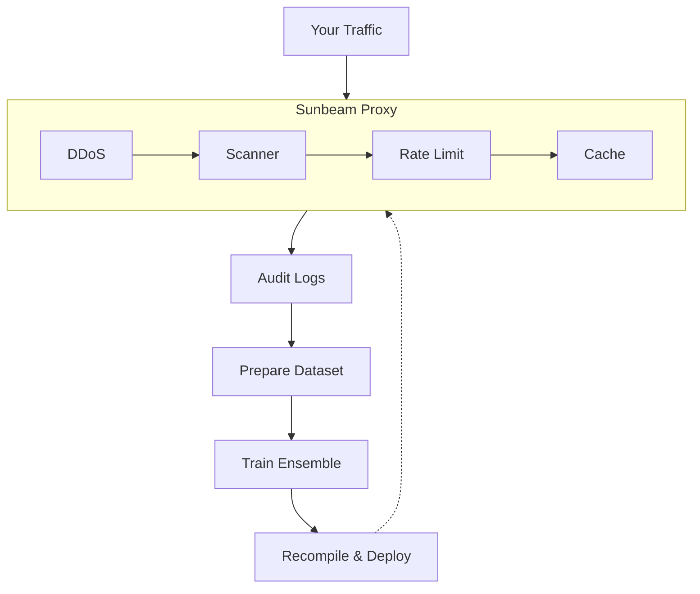
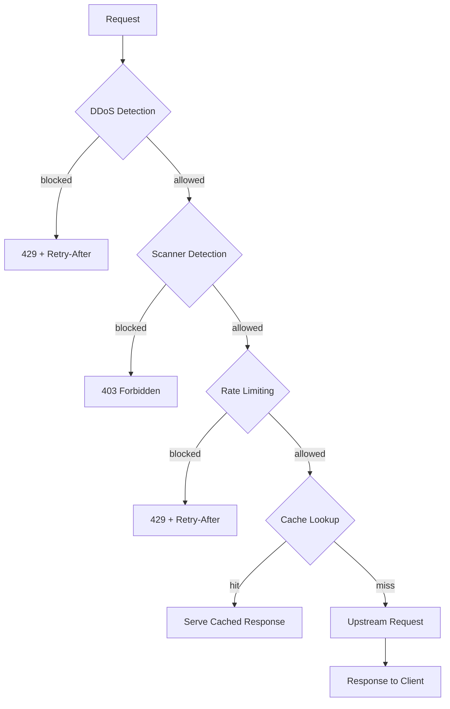

# Sunbeam Proxy

A cloud-native reverse proxy with adaptive ML threat detection. Built in Rust by [Sunbeam Studios](https://sunbeam.pt).

Sunbeam Proxy learns what normal traffic looks like *for your infrastructure* and adapts its defenses automatically. Instead of relying on generic rulesets written for someone else's problems, it trains on your own audit logs to build behavioral models that protect against the threats you actually face.

## Why it exists

We're a small, women-led queer game studio and we need to handle extraordinary threats on today's internet. We are a small team with an even smallerbudget, but the same DDoS attacks, vulnerability scanners, and bot nets that hit everyone else. Off-the-shelf solutions either cost too much, apply someone else's rules to our traffic, or don't work very well. So we built a proxy that learns from what it sees and gets better at protecting us over time — and we figured others could use it too.

This proxy is running in production at Sunbeam Studios. If you are reading this, you are using it!

## What it does

**Adaptive threat detection** — Two ensemble models (decision tree + MLP) run inline on every request. A per-IP DDoS detector watches behavioral patterns over sliding windows. A per-request scanner detector catches vulnerability probes, directory enumeration, and bot traffic. Both models are compiled directly into the binary as Rust `const` arrays — zero allocation, sub-microsecond inference, no model files to manage.

**Rate limiting** — Leaky bucket throttling with identity-aware keys (session cookies, bearer tokens, or IP fallback). Separate limits for authenticated and unauthenticated traffic.

**HTTP response caching** — Per-route in-memory cache backed by pingora-cache. Respects `Cache-Control`, supports `stale-while-revalidate`, sits after the security pipeline so blocked requests never touch the cache.

**Static file serving** — Serve frontends directly from the proxy with try_files chains, SPA fallback, content-type detection, and cache headers. Replaces nginx/caddy sidecar containers with a single config block.

**Cluster gossip** — Multi-node deployments share state via an iroh-based gossip protocol. Nodes discover each other through k8s headless services and coordinate bandwidth tracking across the cluster. (more clustering features coming soon!)

**Dual-stack networking** — Native IPv4 + IPv6 support with separate listeners, explicit `IPV6_V6ONLY` socket options, and fair connection scheduling that alternates accept priority so neither stack gets starved.

**And the rest** — TLS termination with cert hot-reload, host-prefix routing, path sub-routes with prefix stripping, regex URL rewrites, response body rewriting, auth subrequests, WebSocket forwarding, SSH TCP passthrough, HTTP-to-HTTPS redirect, ACME HTTP-01 challenge routing, Prometheus metrics, and per-request tracing with request IDs.

## Quick start

```sh
cargo build
RUST_LOG=info cargo run
```

## How the models work

The detection pipeline uses a two-stage ensemble: a depth-limited CART decision tree makes fast-path decisions (sub-2ns), and a two-layer MLP handles deferred cases (~85ns). Model weights are trained offline using [burn](https://github.com/tracel-ai/burn) with GPU acceleration, then exported as Rust `const` arrays that compile directly into the proxy binary. No model files, no deserialization, no heap allocation at inference time. Both ensembles fit in under 4KiB of L1 cache.

We've also started formalizing safety properties of the ensemble in [Lean 4](https://lean-lang.org/) — proving things like MLP output bounds, tree termination, and ensemble composition correctness. That work lives in `lean4/` and is described in our [research paper](docs/paper/).



Every request produces a structured audit log with 15+ behavioral features. Feed those logs into the training pipeline alongside public datasets (CSIC 2010, CIC-IDS2017), and the models get better at telling your real users apart from threats.

```sh
# 1. Download public datasets (one-time, cached locally)
cargo run -- download-datasets

# 2. Prepare a unified training dataset from your logs + external data
cargo run -- prepare-dataset \
    --input logs.jsonl \
    --output dataset.bin \
    --heuristics heuristics.toml \
    --inject-csic

# 3. Train ensemble models (requires --features training and a GPU)
cargo run --features training -- train-mlp-scanner \
    --dataset dataset.bin \
    --output-dir src/ensemble/gen

cargo run --features training -- train-mlp-ddos \
    --dataset dataset.bin \
    --output-dir src/ensemble/gen

# 4. Recompile with new weights and deploy
cargo build --release

# 5. Replay logs to evaluate accuracy
cargo run -- replay --input logs.jsonl --window-secs 60 --min-events 5
```

Training produces Rust source files in `src/ensemble/gen/` — you commit them, rebuild, and redeploy. The proxy binary always ships with its models baked in.

## Detection pipeline

Every HTTPS request passes through three layers before reaching your backend:

| Layer | Model | Granularity | Response |
|-------|-------|-------------|----------|
| DDoS | Ensemble: decision tree → MLP (14 features) | Per-IP over sliding window | 429 + Retry-After |
| Scanner | Ensemble: decision tree → MLP (12 features) | Per-request | 403 |
| Rate limit | Leaky bucket | Per-identity (session/token/IP) | 429 + Retry-After |

Verified bots (Googlebot, Bingbot, etc.) bypass scanner detection via reverse-DNS verification and configurable allowlists.



## Fair Use

This software is provided as-is, without warranty or support via the Apache License 2.0. With that, Sunbeam Proxy is free to use for any purpose, including commercial use, for up to 1GiBs of total aggregate cluster bandwidth. Anything beyond that will require a license purchase from Sunbeam Studios. This will support ongoing development and ensure billion-dollar companies don't take advantage of it.

If you're interested in a license, please contact us at [hello@sunbeam.pt](mailto:sunbeam@sunbeam.sh).

---

## Configuration reference

All configuration is TOML, loaded from `$SUNBEAM_CONFIG` or `/etc/pingora/config.toml`.

### Listeners and TLS

```toml
[listen]
http  = "0.0.0.0:80"
https = "0.0.0.0:443"

[tls]
cert_path = "/etc/ssl/tls.crt"
key_path  = "/etc/ssl/tls.key"
```

### Telemetry

```toml
[telemetry]
otlp_endpoint = ""         # OpenTelemetry OTLP endpoint (empty = disabled)
metrics_port  = 9090        # Prometheus scrape port (0 = disabled)
```

### Kubernetes

Resource names and namespaces for the cert/config watchers and ACME Ingress routing. Override these if you've renamed the namespace, TLS Secret, or ConfigMap from the defaults.

```toml
[kubernetes]
namespace        = "ingress"        # namespace for Secret, ConfigMap, and Ingress watches
tls_secret       = "pingora-tls"    # TLS Secret name (watched for cert hot-reload)
config_configmap = "pingora-config" # ConfigMap name (watched for config hot-reload)
```

All three fields default to the values shown above, so the section can be omitted entirely if you're using the standard naming.

### Routes

Each route maps a host prefix to a backend. `host_prefix = "docs"` matches requests to `docs.<your-domain>`.

```toml
[[routes]]
host_prefix = "docs"
backend     = "http://docs-backend.default.svc.cluster.local:8080"
websocket   = false                    # forward WebSocket upgrade headers
disable_secure_redirection = false     # true = allow plain HTTP
```

### Path sub-routes

Path sub-routes use longest-prefix matching within a host, so you can mix static file serving with API proxying on the same domain.

```toml
[[routes.paths]]
prefix       = "/api"
backend      = "http://api-backend:8000"
strip_prefix = true                    # /api/users → /users
websocket    = false
```

### Static file serving

When a route has `static_root` set, the proxy tries to serve files from disk before forwarding to the upstream backend. Candidates are checked in order:

1. `$static_root/$uri` — exact file
2. `$static_root/$uri.html` — with `.html` extension
3. `$static_root/$uri/index.html` — directory index
4. `$static_root/$fallback` — SPA fallback

If nothing matches, the request goes to the backend as usual.

```toml
[[routes]]
host_prefix = "meet"
backend     = "http://meet-backend:8080"
static_root = "/srv/meet"
fallback    = "index.html"
```

Path sub-routes always take priority over static serving. Path traversal (`..`) is rejected.

### URL rewrites

Regex patterns are compiled at startup and applied before static file lookup. First match wins.

```toml
[[routes.rewrites]]
pattern = "^/docs/[0-9a-f]{8}-[0-9a-f]{4}-4[0-9a-f]{3}-[89ab][0-9a-f]{3}-[0-9a-f]{12}/?$"
target  = "/docs/[id]/index.html"
```

### Response body rewriting

Find/replace on response bodies, like nginx `sub_filter`. Only applies to `text/html`, `application/javascript`, and `text/javascript` responses — binary responses pass through untouched. The full response is buffered before substitution (fine for HTML/JS, typically under 1MB).

```toml
[[routes.body_rewrites]]
find    = "old-domain.example.com"
replace = "new-domain.sunbeam.pt"
```

### Custom response headers

```toml
[[routes.response_headers]]
name  = "X-Frame-Options"
value = "DENY"
```

### Auth subrequests

Path routes can require an HTTP auth check before forwarding upstream, similar to nginx `auth_request`.

```toml
[[routes.paths]]
prefix               = "/media"
backend              = "http://seaweedfs-filer:8333"
strip_prefix         = true
auth_request         = "http://drive-backend/api/v1.0/items/media-auth/"
auth_capture_headers = ["Authorization", "X-Amz-Date", "X-Amz-Content-Sha256"]
upstream_path_prefix = "/sunbeam-drive/"
```

The proxy sends a GET to `auth_request` with the original `Cookie`, `Authorization`, and `X-Original-URI` headers.

| Auth response | Result |
|--------------|--------|
| 2xx | Capture specified headers, forward to backend |
| Non-2xx | 403 to client |
| Network error | 502 to client |

### HTTP response cache

Per-route in-memory cache backed by pingora-cache.

```toml
[routes.cache]
enabled                     = true
default_ttl_secs            = 60      # TTL when upstream has no Cache-Control
stale_while_revalidate_secs = 0       # serve stale while revalidating
max_file_size               = 0       # max cacheable body size (0 = unlimited)
```

The cache sits after the security pipeline, so blocked requests never populate it. Only caches GET and HEAD. Respects `Cache-Control: no-store` and `private`. TTL priority: `s-maxage` > `max-age` > `default_ttl_secs`.

### SSH passthrough

```toml
[ssh]
listen  = "0.0.0.0:22"
backend = "gitea-ssh.devtools.svc.cluster.local:2222"
```

### DDoS detection

Per-IP behavioral classification over sliding windows using a compiled-in decision tree + MLP ensemble. 14-feature vectors cover request rate, path diversity, error rate, burst patterns, cookie/referer presence, and more.

```toml
[ddos]
enabled      = true
threshold    = 0.6
window_secs  = 60
window_capacity = 1000
min_events   = 10
observe_only = false    # log decisions without blocking (shadow mode)
```

### Scanner detection

Per-request classification with a compiled-in decision tree + MLP ensemble. 12-feature vectors cover path structure, header presence, user-agent classification, and traversal patterns. Verified bot allowlist with reverse-DNS verification.

```toml
[scanner]
enabled            = true
threshold          = 0.5
bot_cache_ttl_secs = 86400
observe_only       = false

[[scanner.allowlist]]
ua_prefix    = "Googlebot"
reason       = "Google crawler"
dns_suffixes = ["googlebot.com", "google.com"]
cidrs        = ["66.249.64.0/19"]
```

### Rate limiting

Leaky bucket per-identity throttling. Identity is resolved as: session cookie > bearer token > client IP.

```toml
[rate_limit]
enabled                = true
eviction_interval_secs = 300
stale_after_secs       = 600
bypass_cidrs           = ["10.42.0.0/16"]

[rate_limit.authenticated]
burst = 200
rate  = 50.0

[rate_limit.unauthenticated]
burst = 50
rate  = 10.0
```

### Cluster

Gossip-based multi-node coordination - nodes discover each other through k8s headless DNS and share bandwidth telemetry. More features coming soon!

```toml
[cluster]
enabled     = true
tenant      = "your-tenant-uuid"
gossip_port = 11204

[cluster.discovery]
method           = "k8s"
headless_service = "sunbeam-proxy-gossip.ingress.svc.cluster.local"

[cluster.bandwidth]
broadcast_interval_secs = 1
stale_peer_timeout_secs = 30
meter_window_secs       = 30
```

---

## Observability

### Request IDs

Every request gets a UUID v4 request ID, attached to a `tracing::info_span!` so all log lines within the request inherit it. The ID is forwarded upstream and returned to clients via the `X-Request-Id` header.

### Prometheus metrics

Served at `GET /metrics` on `metrics_port` (default 9090). `GET /health` returns 200 for k8s probes.

| Metric | Type | Labels |
|--------|------|--------|
| `sunbeam_requests_total` | Counter | `method`, `host`, `status`, `backend` |
| `sunbeam_request_duration_seconds` | Histogram | — |
| `sunbeam_ddos_decisions_total` | Counter | `decision` |
| `sunbeam_scanner_decisions_total` | Counter | `decision`, `reason` |
| `sunbeam_rate_limit_decisions_total` | Counter | `decision` |
| `sunbeam_cache_status_total` | Counter | `status` |
| `sunbeam_active_connections` | Gauge | — |
| `sunbeam_scanner_ensemble_path_total` | Counter | `path` |
| `sunbeam_ddos_ensemble_path_total` | Counter | `path` |
| `sunbeam_cluster_peers` | Gauge | — |
| `sunbeam_cluster_bandwidth_in_bytes` | Gauge | — |
| `sunbeam_cluster_bandwidth_out_bytes` | Gauge | — |
| `sunbeam_cluster_gossip_messages_total` | Counter | `channel` |
| `sunbeam_bandwidth_limit_decisions_total` | Counter | `decision` |

### Audit logs

Every request produces a structured JSON log line (`target = "audit"`):

```json
{
  "request_id": "550e8400-e29b-41d4-a716-446655440000",
  "method": "GET",
  "host": "docs.sunbeam.pt",
  "path": "/api/v1/pages",
  "query": "limit=10",
  "client_ip": "203.0.113.42",
  "status": 200,
  "duration_ms": 23,
  "content_length": 0,
  "user_agent": "Mozilla/5.0 ...",
  "referer": "https://docs.sunbeam.pt/",
  "accept_language": "en-US",
  "accept": "text/html",
  "has_cookies": true,
  "cf_country": "FR",
  "backend": "http://docs-backend:8080",
  "error": null
}
```

These audit logs are the training data. Feed them back into `prepare-dataset` to retrain the models on your actual traffic.

---

## CLI commands

```sh
# Start the proxy server
sunbeam-proxy serve [--upgrade]

# Download upstream datasets (CIC-IDS2017, CSIC 2010)
sunbeam-proxy download-datasets

# Prepare training dataset from audit logs + external data
sunbeam-proxy prepare-dataset --input logs.jsonl --output dataset.bin \
    [--heuristics heuristics.toml] [--inject-csic] \
    [--inject-modsec modsec.log] [--wordlists ./wordlists]

# Train scanner ensemble (requires --features training)
sunbeam-proxy train-mlp-scanner --dataset dataset.bin \
    --output-dir src/ensemble/gen [--epochs 100] [--hidden-dim 32]

# Train DDoS ensemble (requires --features training)
sunbeam-proxy train-mlp-ddos --dataset dataset.bin \
    --output-dir src/ensemble/gen [--epochs 100] [--hidden-dim 32]

# Sweep cookie_weight hyperparameter
sunbeam-proxy sweep-cookie-weight --dataset dataset.bin --detector scanner

# Replay logs through compiled-in ensemble models
sunbeam-proxy replay --input logs.jsonl [--window-secs 60] [--min-events 5]
```

---

## Building

```sh
cargo build                                               # debug
cargo build --features training                           # with burn-rs training pipeline
cargo test                                                # all tests (244 tests)
cargo bench                                               # ensemble inference benchmarks
cargo clippy -- -D warnings                               # lint
```

The `training` feature pulls in burn-rs and wgpu for GPU-accelerated training. The default build (without `training`) has no GPU dependencies — it just uses the compiled-in weights.

## License

Apache License 2.0. See [LICENSE](LICENSE).

Contributions require a signed CLA — see [CONTRIBUTING.md](CONTRIBUTING.md) and [CLA.md](CLA.md) for details.
