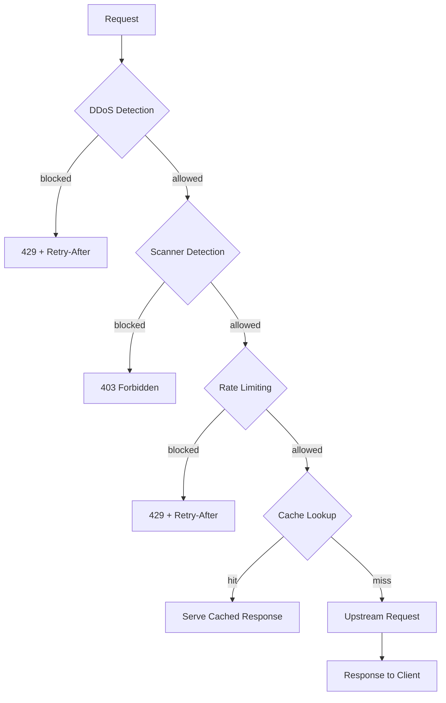

# Threat Detection

## Detection pipeline

Every HTTPS request passes through three layers before reaching your backend:

| Layer | Model | Granularity | Response |
|-------|-------|-------------|----------|
| DDoS | Ensemble: decision tree → MLP (14 features) | Per-IP over sliding window | 429 + Retry-After |
| Scanner | Ensemble: decision tree → MLP (12 features) | Per-request | 403 |
| Rate limit | Leaky bucket | Per-identity (session/token/IP) | 429 + Retry-After |

Verified bots (Googlebot, Bingbot, etc.) bypass scanner detection via reverse-DNS verification and configurable allowlists.



## How the models work

The detection pipeline uses a two-stage ensemble: a depth-limited CART decision tree makes fast-path decisions (sub-2 ns), and a two-layer MLP handles deferred cases (~85 ns). Model weights are trained offline using [burn](https://github.com/tracel-ai/burn) with GPU acceleration, then exported as Rust `const` arrays that compile directly into the proxy binary. Because weights are compiled into the binary, inference requires no model files, deserialization, or heap allocation. Both ensembles fit in under 4 KiB of L1 cache.

The project also includes formal verification of safety properties in [Lean 4](https://lean-lang.org/) — proving things like MLP output bounds, tree termination, and ensemble composition correctness. That work lives in `lean4/` and is described in our [research paper](../docs/paper/).

## Training workflow

```sh
# 1. Download public datasets (one-time, cached locally)
cargo run -- download-datasets

# 2. Prepare a unified training dataset from your logs + external data
cargo run -- prepare-dataset     --input logs.jsonl     --output dataset.bin     --heuristics heuristics.toml     --inject-csic

# 3. Train ensemble models (requires --features training and a GPU)
cargo run --features training -- train-mlp-scanner     --dataset dataset.bin     --output-dir src/ensemble/weights

cargo run --features training -- train-mlp-ddos     --dataset dataset.bin     --output-dir src/ensemble/weights

# 4. Recompile with new weights and deploy
cargo build --release

# 5. Replay logs to evaluate accuracy
cargo run -- replay --input logs.jsonl --window-secs 60 --min-events 5
```

Training produces Rust source files in `src/ensemble/weights/` — you commit them, rebuild, and redeploy. The proxy binary always ships with its models baked in.
